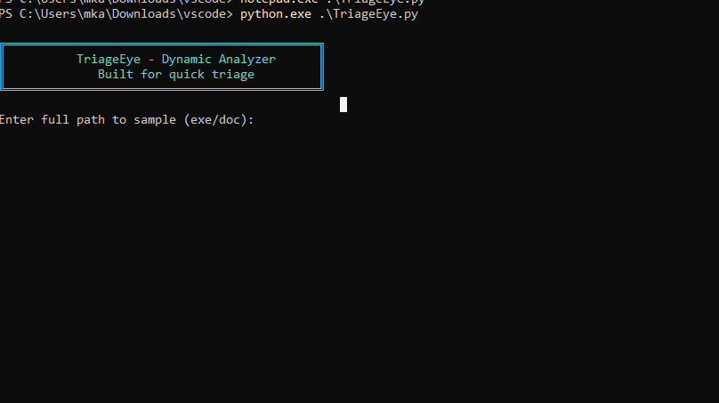

# TriageEye 👁️ v2.1

**TriageEye** is a high-speed dynamic malware analysis tool for Windows. It provides a flexible monitoring environment to capture the behavior of suspicious executables, documents, or already-running processes.

---

## 🚀 Four Specialized Analysis Modes
TriageEye now supports four distinct workflows to handle different malware delivery methods:

1. **Launch EXE:** Executes a standalone binary in a new console and tracks its entire lifecycle.
2. **Open Office Document:** Monitors the behavior of Word, Excel, or PowerPoint macros by tracking the associated handler process.
3. **Attach to PID:** Instantly hooks into a currently running process ID to capture ongoing activity.
4. **Wait for Process Name:** Passive monitoring mode that waits for a specific process (e.g., `explorer.exe` or `cmd.exe`) to appear before starting analysis.

---

## 🛡️ Monitoring Capabilities (Best-Effort)
* **Process Tree:** Tracks descendants of the root PID using **ETW** (`Microsoft-Windows-Kernel-Process`) and live snapshots.
* **Network Activity:** Captures established TCP/UDP connections using `psutil`.
* **Registry Activity:** Monitors persistence and configuration changes via **ETW** (`Microsoft-Windows-Kernel-Registry`).
* **File Operations:** Tracks dropped files and activity in "interesting paths" (`Temp`, `Downloads`, `Startup`) via **ETW** (`Microsoft-Windows-Kernel-File`).

---

## 📊 Automated Reporting
At the end of every session, TriageEye generates:
* **HTML Report:** A clean, dark-themed dashboard showing network connections and the "Juicy Score."
* **JSON Report:** A full structured data dump for deeper technical analysis.
* **Console Output:** Real-time, color-coded logging of tracing status and discovery.

---

## 🛠️ Requirements & Setup
* **OS:** Windows 10/11 (Requires **Administrator** for ETW sessions).
* **Language:** Python 3.9+.
* **System Tools:** `logman` and `tracerpt` (Built-in to Windows).

### Quick Start:
1. **Clone the repo:** `git clone https://github.com/mka/TriageEye.git`
2. **Run the launcher:** Right-click `run.bat` -> **Run as Administrator**.
3. **Select Mode:** Choose 1–4 based on your sample type.

> [!CAUTION]
> **Safety Warning:** Always execute TriageEye inside a hardened Virtual Machine. Never analyze live malware on your primary host system.

  

---

## 👤 Author
**AgentZeroX** - Penetration Tester & Security Researcher

## 📄 License
Licensed under the MIT License.
